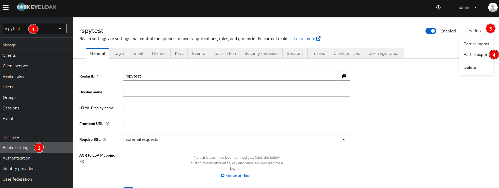
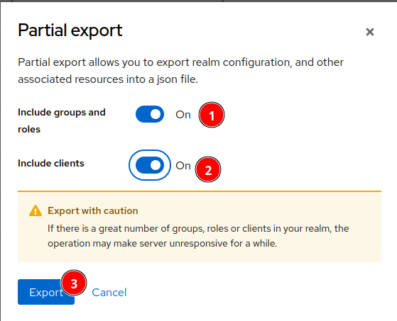

# Keyclock realm export import

## Export existing realm

- Go to the Keycloak admin web page: `https://iam.{{ platform_domain_name }}/admin`
- Export the realm:
  1. Select the realm
  2. Click on Realm settings
  3. Click on Action
  4. Click on Partial export
  
- On the new pop-up
  1. Turn "On" for the two options "Include groups and roles" and "Include clients"
  
- Convert the downloaded file from `JSON` to `YAML`
- Create the `KeycloakRealmImport` file (you can find an e.g. in [the keycloak app folder](../../apps/keycloak/keycloakrealmimport.yaml)):

  ```yaml
   apiVersion: k8s.keycloak.org/v2alpha1
   kind: KeycloakRealmImport
   metadata:
     name: rspytest
     namespace: iam
   spec:
     keycloakCRName: keycloak
     realm:
       <YAML FROM PREVIOUS STEP>
   ```

- Remove any `authorizationSettings` section with a `config.code` section in it like in this commit: <https://github.com/RS-PYTHON/rs-infra-core/commit/cbeae0b10851593081cb88e11d31da0157c0d781>
- Remove all the `id` to avoid conflict during the import process (replace `<YOUR_REALM_YAML_FILE.yaml>`) using `sed` in a `bash` terminal:

  ```bash
  sed -E 's#[[:space:]]{7}- id: [0-9a-f]{8}-[0-9a-f]{4}-[0-9a-f]{4}-[0-9a-f]{4}-[0-9a-f]{12}#       -#g' -i <YOUR_REALM_YAML_FILE.yaml>

  sed ':a;N;$!ba;s/-\n         /-/g' -i <YOUR_REALM_YAML_FILE.yaml>

  sed -E 's#[[:space:]]{6}- id: [0-9a-f]{8}-[0-9a-f]{4}-[0-9a-f]{4}-[0-9a-f]{4}-[0-9a-f]{12}#      -#g' -i <YOUR_REALM_YAML_FILE.yaml>

  sed ':a;N;$!ba;s/-\n        /- /g' -i <YOUR_REALM_YAML_FILE.yaml>

  sed -E 's#[[:space:]]{4}- id: [0-9a-f]{8}-[0-9a-f]{4}-[0-9a-f]{4}-0-9a-f]{4}-[0-9a-f]{12}#    -#g' -i <YOUR_REALM_YAML_FILE.yaml>

  sed ':a;N;$!ba;s/-\n      /- /g' -i <YOUR_REALM_YAML_FILE.yaml>
  ```

- For the clients using `SAML` like Wazuh (`clientId: wazuh-saml`), you need to **remove** the 3 following lines if they exist in the `attributes` section (`saml.signing.certificate`, `saml.artifact.binding.identifier` and `saml.signing.private.key`):

  ```yaml
  "attributes": {
    [...]
    "saml.signing.certificate": "MIICozCCAYsCBgGRIakcRjANBgkqhkiG9w0BAQsFADAVMRMwEQYDVQQDDAp3YXp1aC1zYW1sMB4XDTI0MDgwNTA4MjgzNloXDTM0MDgwNTA4MzAxNlowFTETMBEGA1UEAwwKd2F6dWgtc2FtbDCCASIwDQYJKoZIhvcNAQEBBQADggEPADCCAQoCggEBAJ7Nf2itrFa7bSIa+S3T1cgVd6cXV0KuA3EmRkp2qCXeyV5T1VFsvIJoDPklHT6+9rqzegps1+I7bB7EP10PJBvChluu6ql+RvE8MpIxB/RXeXVev32RH052YzaDq1O7i0t9DqbanpOHt6b7XNdeQg+xxxxxxxxxxxxxxxxxxxxxxxxxxxxxxxxxxxxxxxxxxxxxxxxxxxxxxxxxxxxxxxxxxxxxxxxxxxxxxxxxxxOSl0ijgDd13ntIUD4Zop9vtw22uPmAoy2HA2QJlqhb9yHfmnDnHbQJUAlmjtNQvPwMgM3mSGfkPA1KJuf26kDX/sm7QddxmPbH+kCi6Z4EG2odO0EZGyDNwrO44MIiVgPcdivNwhMa/Do52iN3YfnvhHGh5ZukLnvVT0U1pZoinw4StlM24zSz6TLgvx6hI0o/UVg3lSZHqaS947Ki0llUy85iIFF14nXQ==",
    "saml.artifact.binding.identifier": "dGRFU+BI7ptxxxxxxxxRV+rz21BA=",
    [...]
    "saml.signing.private.key": "MIIEogIBAAKCAQEAns1/aK2sVrttIhr5LdPVyBV3pxdXQq4DcSZGSnaoJd7JXlPVUWy8gmgM+SUdPr72urN6CmzX4jtsHsQ/XQ8kG8KGW67qqX5G8TwykjEH9Fd5dV6/fZEfTnZjNoOrU7uLS30Optqek4e3pvtc115CD7el/YWON3e8WSE7BYwEC1gE+vLo0qyDRbmsjYPleMuok/pxD9U07ETdN/aiGB2jjRQbyVZ9t45qO+Auq+lbVFUmOzhDFuzvSCA10KNhjmT+Tkx+KRffwX1nJ0q4/gSXkpwiN5gpit5+wszhaBseRK41QlxxxxxxxxxxxxxxxxxxxxxxxxxxxxxxxxxxxxxxxxxxxxxxxxxxxxxxxxxxxlGnib5p7ik9Hl2jlJBwzq/2ejpjrt0XrYkFVLro4GJ6sfSmgmFh+28+MKiTN2PG2ZNFCv6WIUUVcBeIFKHBhvw5Q2Jnj2DyuF7GK2vifXlMCgYEA2O8Un5lr9wLhGDfYNAzl5JcxoYPEFC4HptltjgeToMyTMwB3HPCE32LzATdVLFqZ30knquLKvAJYXpf7rCtgs51Te0YtrEtuOgDdidxoibM9efPOj7kl1y9uiapa5P5QUhnXCcv0z/+/7Dd59LKb9kvN9w70KmndbgB4rdrJDMMCgYEAu2Z/jMBk/cDVcrIVjG8SJ+9gZeppen2kmX4G253vk6ibaLimm3dbE9f7XmP9unvrUf4BlLXY5N2dsMkaBYqsQo0UFxM+soKpg4YGY9Dv4PottBCmCYPInfob8jP/7g5zeWwA5TYbtlnFJqWHHWOEjs2XUnzHB5gyvYSQgwJsp18CgYAu5pml28yszdGOo9w5fKRjZJDVY6CL4FvFJfL6pway2Cfm+e3GsvV3OnRhSe4/NaNY0/8gggHk3fjvEprV4Vb53kTDPSv4uSIupis/eAid5MOgzyZUimn0+QtD9jHKmnURGwcT1iWqppd+4YubbNYtTLxN8sy1Msgt1SpCJDAdcwKBgFeLkpqWZpeEtjJWr2pjmP++/DGgSJZIi9SI43tFVN6OLcvGN075ezrR80QtQiMUMOKk3ugx65k/TqN/zwA3wDF25qPBAdEy6S3gNqv6t5VKSn+MJ4TaY6YpaVTEphL3/UoEAocRt/CAD3H2ciBwlUSBFugaEoChwVJ302rgfxHRAoGAV1iXOgAogBPSItgQqF6HS0SltEx2HOwnqSfWzaxGmvSglYeoGXJvfgC4yq9404b7GmRjY+3chjo2j5Gw1K3Q3QNkoLusCEPEGhJssVVYilVHHCku1VnG2j2+vlb0AfUS8jKVjoUQFgU2zHTp9c2JX6t1CGTNWOs1VYG7BOP23HA=",
   [...]
  }
  ```

- For the clients using `SAML` like Wazuh (`clientId: wazuh-saml`), you need to set `saml.client.signature` and `saml.server.signature` to `true` in the `attributes` section
- Replace all references of your platform domain name `example.com` to `{{ platform_domain_name }}`

## Import a `KeycloakRealmImport` file

!!! warning "Disclaimer: Keycloak downtime"
    Upon a sucessfull import of a realm, the Keycloak pod will restart and a short downtime will be observed (around 1 minute).

Use kubectl to import the `KeycloakRealmImport` file:

```bash
kubectl -n iam apply -f <YOUR_REALM_YAML_FILE.yaml>
```

Note: you can follow the import process by watching the logs of the newly created pod:

```bash
kubectl -n iam logs <YOUR REALM NAME>-<random suffix> --follow
```

E.g. :

```bash
kubectl -n iam logs rspytest-gp7zv --follow

Changes detected in configuration. Updating the server image.
Updating the configuration and installing your custom providers, if any. Please wait.
2024-09-04 08:08:33,077 INFO  [io.quarkus.deployment.QuarkusAugmentor] (main) Quarkus augmentation completed in 13853ms
Server configuration updated and persisted. Run the following command to review the configuration:

        kc.sh show-config

Next time you run the server, just run:

        kc.sh build --optimized

The following run time non-cli properties were found, but will be ignored during build time: kc.db-url-host, kc.db-username, kc.db-password, kc.hostname, kc.hostname-admin-url, kc.http-enabled, kc.http-port, kc.https-port, kc.proxy, kc.log-level
Updating the configuration and installing your custom providers, if any. Please wait.
2024-09-04 08:08:43,587 INFO  [io.quarkus.deployment.QuarkusAugmentor] (main) Quarkus augmentation completed in 8257ms
Server configuration updated and persisted. Run the following command to review the configuration:

        kc.sh show-config

The following build time non-cli properties were found, but will be ignored during run time: kc.db
2024-09-04 08:08:45,222 INFO  [org.keycloak.quarkus.runtime.hostname.DefaultHostnameProvider] (main) Hostname settings: Base URL: <unset>, Hostname: iam.example.com, Strict HTTPS: false, Path: <request>, Strict BackChannel: false, Admin URL: https://iam.example.com, Admin: iam.example.com, Port: -1, Proxied: true
2024-09-04 08:08:47,229 WARN  [io.quarkus.agroal.runtime.DataSources] (main) Datasource <default> enables XA but transaction recovery is not enabled. Please enable transaction recovery by setting quarkus.transaction-manager.enable-recovery=true, otherwise data may be lost if the application is terminated abruptly
2024-09-04 08:08:47,686 WARN  [org.infinispan.PERSISTENCE] (keycloak-cache-init) ISPN000554: jboss-marshalling is deprecated and planned for removal
2024-09-04 08:08:47,729 WARN  [org.infinispan.CONFIG] (keycloak-cache-init) ISPN000569: Unable to persist Infinispan internal caches as no global state enabled
2024-09-04 08:08:47,828 INFO  [org.infinispan.CONTAINER] (keycloak-cache-init) ISPN000556: Starting user marshaller 'org.infinispan.jboss.marshalling.core.JBossUserMarshaller'
2024-09-04 08:08:48,818 INFO  [org.keycloak.broker.provider.AbstractIdentityProviderMapper] (main) Registering class org.keycloak.broker.provider.mappersync.ConfigSyncEventListener
2024-09-04 08:08:49,380 INFO  [org.keycloak.connections.infinispan.DefaultInfinispanConnectionProviderFactory] (main) Node name: node_754822, Site name: null
2024-09-04 08:08:50,255 INFO  [org.keycloak.exportimport.singlefile.SingleFileImportProvider] (main) Full importing from file /mnt/realm-import/rspytest-realm.json
2024-09-04 08:08:56,052 INFO  [org.keycloak.exportimport.util.ImportUtils] (main) Realm 'rspytest' imported
2024-09-04 08:08:56,184 INFO  [io.quarkus] (main) Keycloak 23.0.6 on JVM (powered by Quarkus 3.2.10.Final) started in 12.339s. Listening on:
2024-09-04 08:08:56,184 INFO  [io.quarkus] (main) Profile import_export activated.
2024-09-04 08:08:56,184 INFO  [io.quarkus] (main) Installed features: [agroal, cdi, hibernate-orm, jdbc-h2, jdbc-mariadb, jdbc-mssql, jdbc-mysql, jdbc-oracle, jdbc-postgresql, keycloak, logging-gelf, micrometer, narayana-jta, reactive-routes, resteasy-reactive, resteasy-reactive-jackson, smallrye-context-propagation, smallrye-health, vertx]
2024-09-04 08:08:56,240 INFO  [io.quarkus] (main) Keycloak stopped in 0.052s
```
