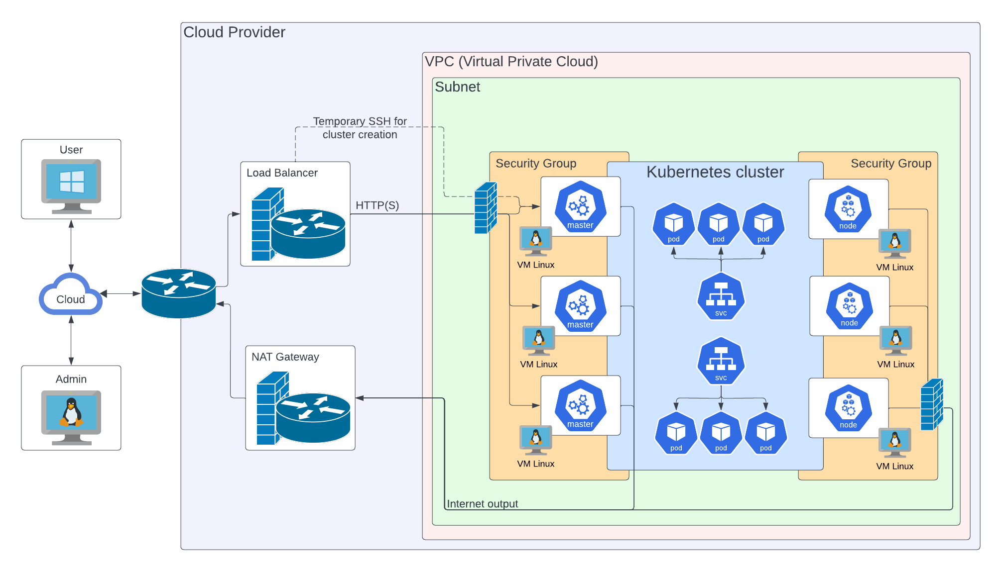

# Infrastructure - Installation
## Overview



> **Admin's machine is called BASTION in the rest of the installation manual**

## _Bastion_ requirements

- miniforge
- git
- jq

## Dependencies

### Terraform

This project exploits Terraform to deploy the infrastructure on the Cloud Provider.  
The fully detailed documentation and configuration options are available on its page: [https://www.terraform.io/](https://www.terraform.io/)

### Kubespray

This project exploits Kubespray to deploy Kubernetes.  
The fully detailed documentation and configuration options are available on its page: [https://kubespray.io/](https://kubespray.io/)

### HashiCorp Vault (optional)

This project can integrate credentials from a custom `HashiCorp Vault` instance, see the specific documentation: [how to/Credentials](./how-to/Credentials.md)

### Openstack CLI

This project exploits Openstack CLI to manage the state of the infrastructure on the Cloud Provider.  
The fully detailled documentation and configuration options are available on its page: [https://docs.openstack.org/newton/user-guide/cli.html](https://docs.openstack.org/newton/user-guide/cli.html)

## Quickstart

### 1. Get the rs-infrastructure repository

```shellsession
git clone https://github.com/RS-PYTHON/rs-infrastructure.git
cd rs-infrastructure
```

### 2. Install requirements

```shellsession
# Install miniforge
mkdir -p ~/miniforge3
wget "https://github.com/conda-forge/miniforge/releases/latest/download/Miniforge3-$(uname)-$(uname -m).sh" -O ~/miniforge3/miniforge.sh
bash ~/miniforge3/miniforge.sh -b -u -p ~/miniforge3
rm -f ~/miniforge3/miniforge.sh

# Init conda depending on your shell
~/miniforge3/bin/conda init bash
~/miniforge3/bin/conda init zsh

# Create conda env with python=3.11 and activate it
conda create -y -n rspy python=3.11
conda activate rspy

# Install Ansible, Terraform, Openstackclient
conda install conda-forge::ansible
conda install conda-forge::terraform
conda install conda-forge::python-openstackclient
conda install conda-forge::passlib

# Init Kubespray collection with remote
git submodule update --init --remote

pip install -U pyOpenSSL ecdsa -r collections/kubespray/requirements.txt

ansible-galaxy collection install \
    kubernetes.core \
    openstack.cloud
```

### 3. Copy the sample inventory

```shellsession
cp -rfp inventory/sample inventory/mycluster
```

### 4. Review and change the default configuration to match your needs

```shellsession
cp -rfp roles/terraform/create-cluster/tasks/.env.template roles/terraform/create-cluster/tasks/.env
```

Copy the openrc.sh.template into openrc.sh and change the values inside to match your configuration :

```shellsession
cp -rfp inventory/mycluster/openrc.sh.template inventory/mycluster/openrc.sh
```

- Credentials, domain name, the stash license, S3 endpoints in `inventory/mycluster/host_vars/setup/main.yaml`
- Credentials in `roles/terraform/create-cluster/tasks/.env`
- Credentials, domain name in `inventory/mycluster/openrc.sh`
- Node groups, Network sizing, S3 buckets in `inventory/mycluster/cluster.tfvars`
- S3 backend for terraform in `inventory/mycluster/backend.tfvars`
- Optimization for well-known zones and/or internal-only domains, i.e. VPN/Object Storage for internal networks in `inventory/mycluster/group_vars/all/kubespray.yaml`
- Values for custom parameters in `inventory/mycluster/group_vars/all/apps.yml`

### 5. Create and configure machines

```shellsession
ansible-playbook cluster.yaml \
    -i inventory/mycluster/hosts.yaml
```

### 6. Deploy Kubernetes with `kubespray`

```shellsession
ansible-playbook kubernetes.yaml \
    -i inventory/mycluster/hosts.yaml
```

### 7. Deploy the apps

!!! warning "Disclaimer : For Wazuh Server installation"
    See **_"1. Enable Bcrypt encryption"_** in the [Wazuh-Server_Install](./how-to/Wazuh-Server_Install.md) and update the `encrypt.py` library before deploy the apps.

```shellsession
ansible-playbook apps.yaml \
    -i inventory/mycluster/hosts.yaml
```

!!! warning "Disclaimer : For Prefect-Worker post-configuration"
    See **_"2. set `Concurrency Limit` on workpool _on-demand-k8s-pool_"_** in the [Prefect-Worker](./how-to/Prefect-Worker.md) after deploy the app.

# Copyright and license

The Reference System Software as a whole is distributed under the Apache License, version 2.0. A copy of this license is available in the [LICENSE](../LICENSE) file. Reference System Software depends on third-party components and code snippets released under their own license (obviously, all compatible with the one of the Reference System Software). These dependencies are listed in the [NOTICE](../NOTICE.md) file.

<br> <br>

<!---
Centering the banner logo image is not rendered by the mkdocs inside the rs-documentation repository
-->
<!---
<p align="center">
 
</p>
-->
<p align="center">This project is funded by the EU and ESA.</p>
<br> <br>
